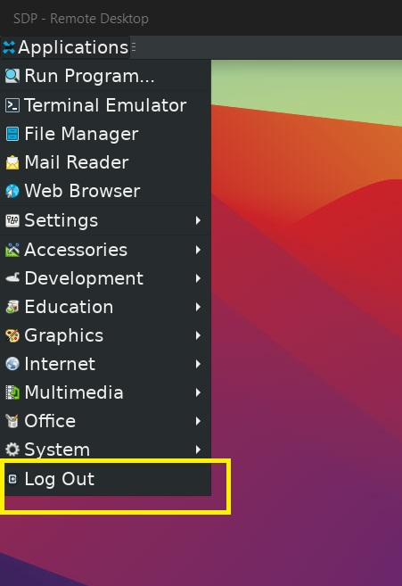

.. faq

Frequently Asked Questions
==========================

Connection Issues
-----------------

SSH connection refused
^^^^^^^^^^^^^^^^^^^^^^^

.. code-block:: bash

    [~ login] ssh user@sdp.ipp.ac.cn
    ssh: connect to host sdp.ipp.ac.cn port 22: Connection refused

Find the port number in the account creation email holding your account initial password. Then follow the instruction in :ref:`SSH Connection (Linux or MacOS)`

Remote Desktop Connection crash
^^^^^^^^^^^^^^^^^^^^^^^^^^^^^^^
If you have already started a connection and changed to another client or color depth settings, follow the instruction below:

- Login using previous client with previous color depth.
- Logout the connection.

- Change the color depth or use the new RDP client.

IDE Issues
------------------

MATLAB screen is blank
^^^^^^^^^^^^^^^^^^^^^^^
See :ref:`Matlab IDE`.