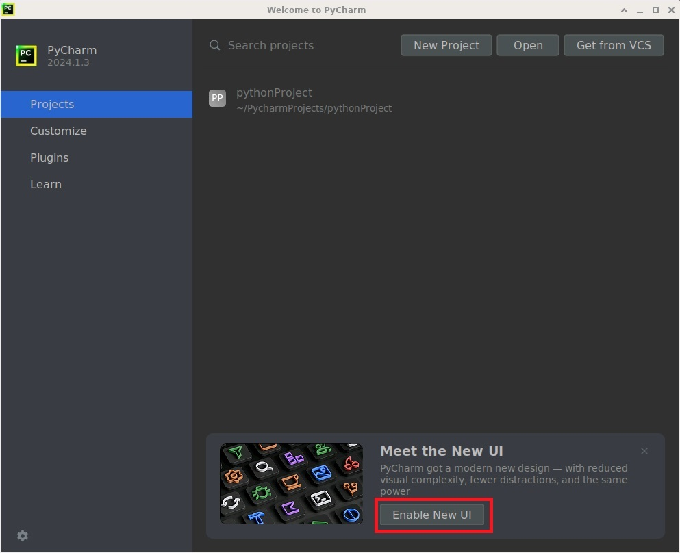
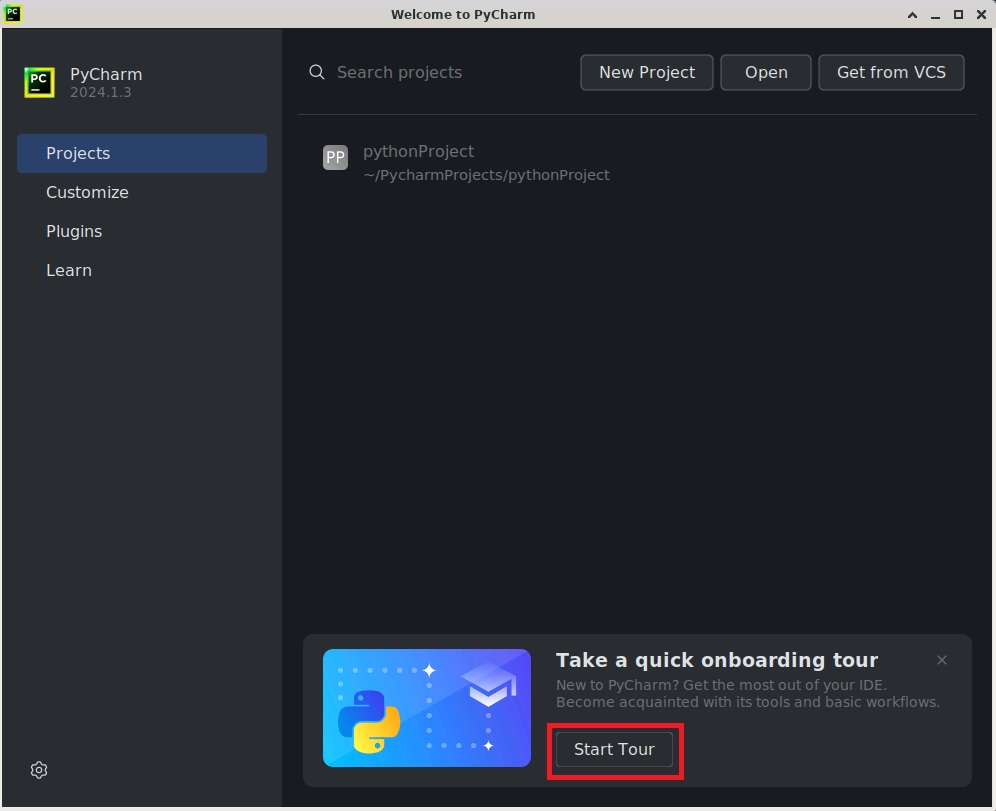
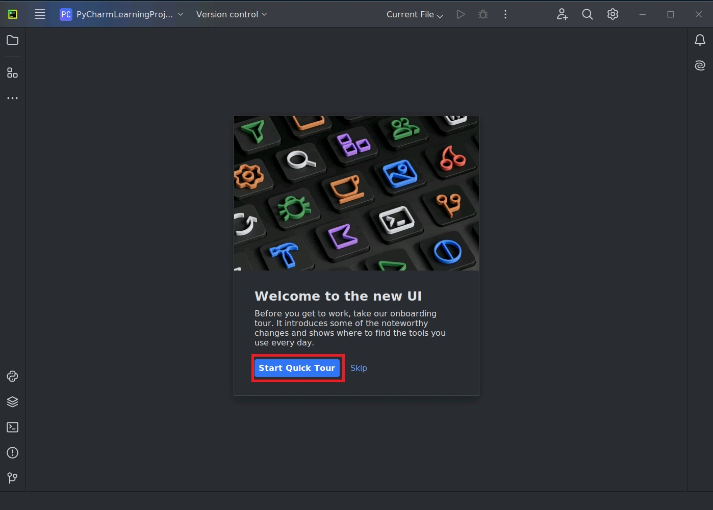
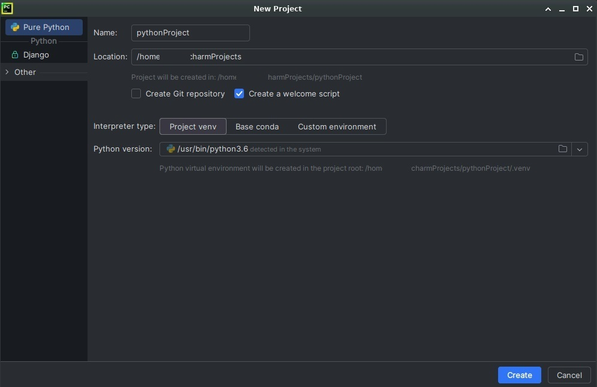
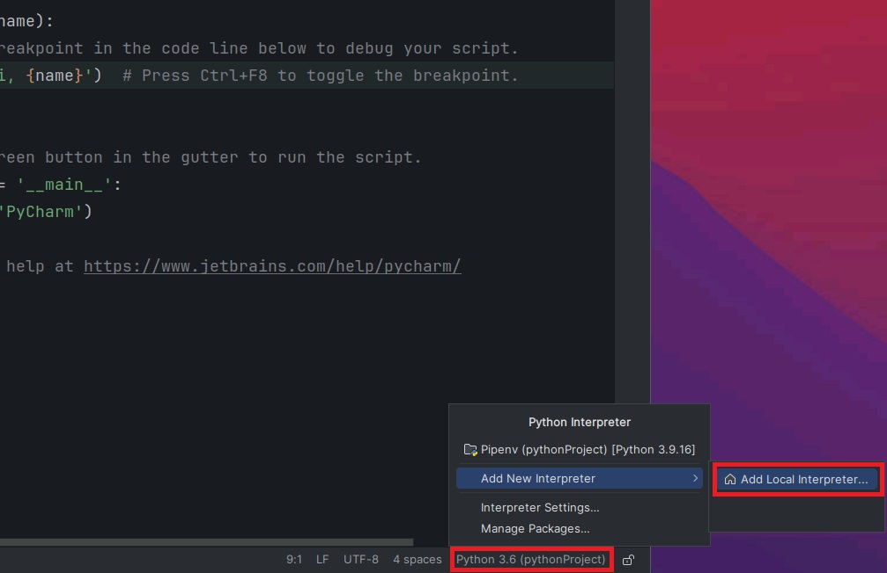
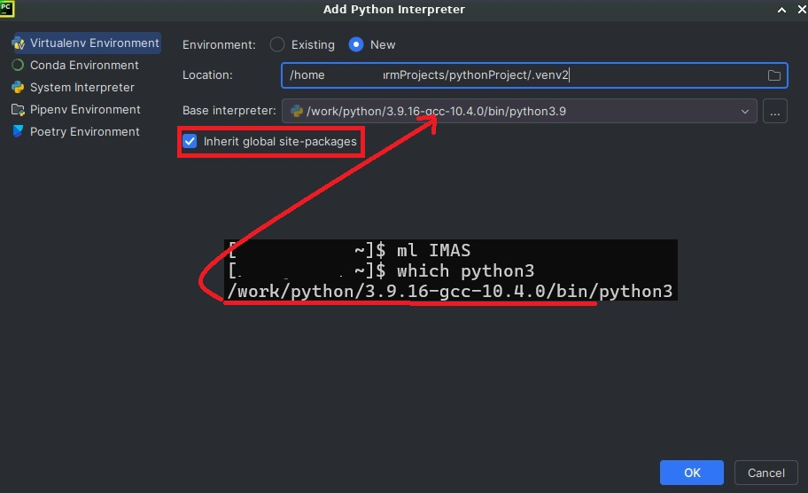
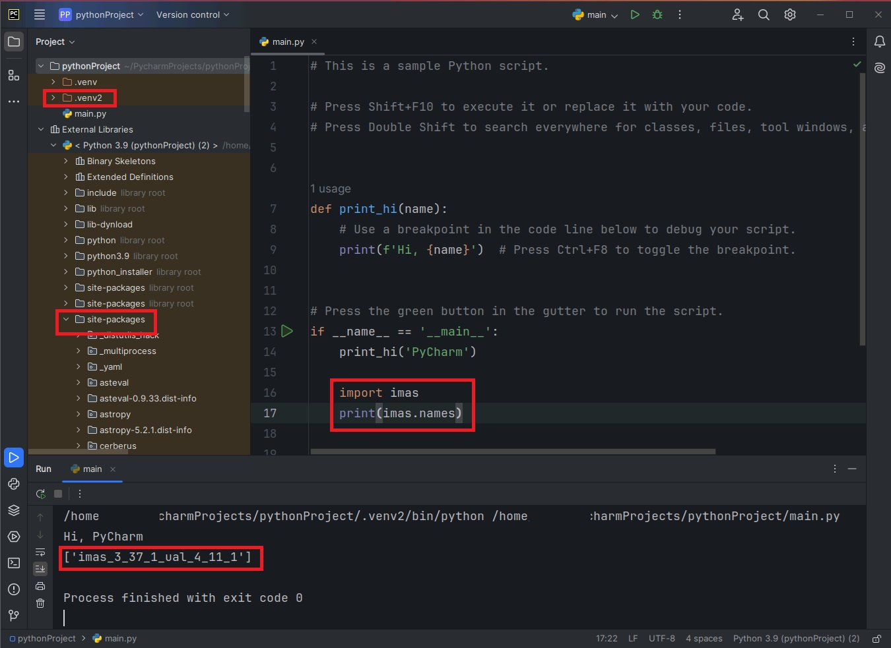

.. ide

Programming IDE
===================

Several IDEs or editors have been installed on the SDP server. To use these GUI applications, one should either connects to the SDP server using remote desktop or SSH with X11 enabled (see :ref:`User Connection`). Some of the IDEs need the corresponding module (see :ref:`Environment Modules`) loaded before using.

---------------------------
MATLAB IDE
---------------------------
MATLAB is a well-known mathematical programming tool for scientific research. Load the corresponding version of MATLAB and use ``matlab`` command to start it.

.. code-block:: bash
    
    [xiangliu@localhost ~] module load IDE/MATLAB
    [xiangliu@localhost ~] matlab

.. warning:: 

    Due to the bug of java 1.8, MATLAB GUI is blank when using **Microsoft Remote Desktop** or **Remote Desktop Connection** with 32-bit depth of color to connect to the SDP. Try :ref:`mobaxterm (windows)` instead. Or change the color depth to 16-bit using **Remote Desktop Connection** (see below).

.. image:: pic/user_connection_win_remote_desktop_display.jpg

---------------------------
PyCharm IDE
---------------------------

`PyCharm <https://www.jetbrains.com/pycharm/download>`_ is a powerful Python IDE. One can learn how to use this tool in the `Official Learn PyCharm Website <https://www.jetbrains.com/pycharm/learn>`_. To start the PyCharm IDE, load the PyCharm module and type ``pycharm.sh`` command in the shell.

.. code-block:: bash
    
    [xiangliu@localhost ~] ml IDE/PyCharm
    [xiangliu@localhost ~] pycharm.sh

In the opened welcome window, click the **Enable New UI** button below. Then PyCharm will be automatically restarted.

If you are new to PyCharm, click **Start Tour** button to get acquainted. If you are familiar with PyCharm, just click **New Project** button in the welcome window. This will lead you to the project configuration window. 

Select the corresponding environment you like and click **Create** to continue. Then you can run and debug the python scripts.

If you want to use IMAS, close PyCharm and type the following commands.

.. code-block:: bash
    
    [xiangliu@localhost ~] ml IDE/PyCharm
    [xiangliu@localhost ~] ml IMAS
    [xiangliu@localhost ~] pycharm.sh

The project's python interpreter should be changed by clicking the bottom-right text started with "Python".

Choose **Virtualenv**, tick **New**, and add "2" (can be any string, just added to skip the existing ".venv" directory). Open another terminal and type ``ml IMAS`` and ``which python3`` commands to get the python directory used for IMAS. Then manually select the python executable that is used for IMAS. Finally, tick  **Inherit global site-packages**, and click the **Create** button.

.. note::
    
    When **Inherit global site-packages** is ticked, all the packages including numpy, matplotlib, tofu, etc will be copied into the virtual environment.

It is seen that the default virtual environment has been changed and the site-packages have been copied. Insert the two test lines for IMAS and click run buttion on the top title bar. The ``imas`` module can then be used right away.

.. warning::

    The packages that updated for IMAS should be manually installed for the virtual environment.

---------------------------
VSCode Editor
---------------------------

VSCode is a light-weighted fashionable editor, supporting most of the programming language through extensions. Simply type ``code`` in the terminal to open this IDE. One can refer to the `VSCode Documentation <https://code.visualstudio.com/Docs>`_ for details. 

VSCode also support editing the codes on the server through the `Remote-SSH <https://marketplace.visualstudio.com/items?itemName=ms-vscode-remote.remote-ssh>`_ extension.
