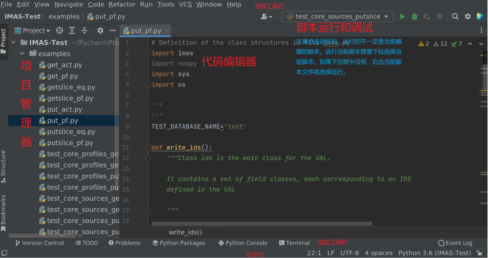
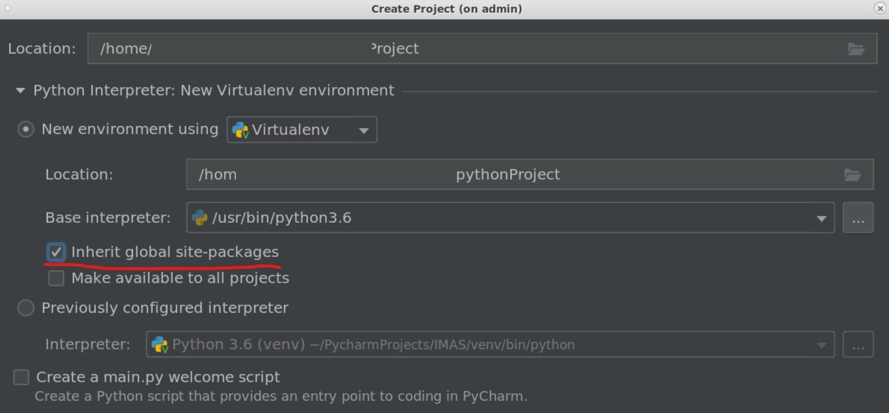
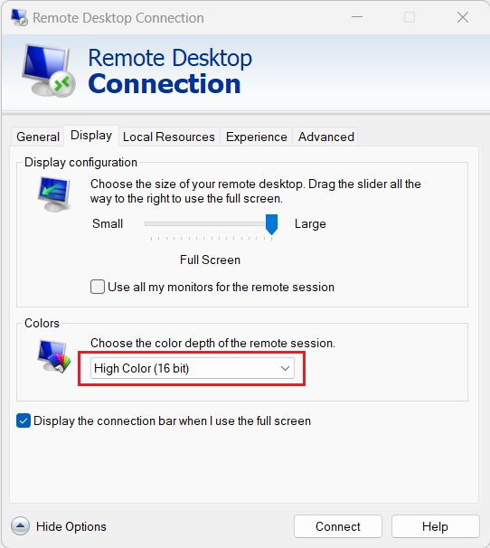

.. ide

Programming IDE
===================

Several IDEs or editors have been installed on the SDP server. To use these GUI applications, one should either connects to the SDP server using remote desktop or SSH with X11 enabled (see :ref:`User Connection`). Some of the IDEs need the corresponding module (see :ref:`Environment Modules`) loaded before using.

---------------------------
PyCharm IDE
---------------------------

`PyCharm <https://www.jetbrains.com/pycharm/download>`_ is a powerful Python IDE. One can learn how to use this tool in the `Official Learn PyCharm Website <https://www.jetbrains.com/pycharm/learn>`_. The picture below briefly introduces the key element of this Python IDE.

To start the PyCharm IDE, load the PyCharm module and type ``pycharm.sh`` command in the shell.

.. code-block:: bash
    
    [xiangliu@localhost ~] module load IDE/PyCharm
    [xiangliu@localhost ~] pycharm.sh

An important thing when you create a new project using PyCharm is to configure the interpreter. Since, some basic packages including numpy, matplotlib, tofu, etc have already been installed in the system site-packages, using a virtual environment (Virtualenv) with ``Inherit global site-packages`` ticked is recommended for convenience.

.. note:: 
    If you already have a Virtualenv being configured, using ``Previously configured interpreter`` is also a very nice choice.

---------------------------
MATLAB IDE
---------------------------

MATLAB is a well-known mathematical programming tool for scientific research. Load the corresponding version of MATLAB and use ``matlab`` command to start it.

.. code-block:: bash
    
    [xiangliu@localhost ~] module load IDE/MATLAB
    [xiangliu@localhost ~] matlab

.. warning:: 

    Due to the bug of java 1.8, MATLAB GUI is blank when using **Microsoft Remote Desktop** or **Remote Desktop Connection** with 32-bit depth of color to connect to the SDP. Try :ref:`mobaxterm (windows)` instead. Or change the color depth to 16-bit using **Remote Desktop Connection** (see below).

---------------------------
VSCode Editor
---------------------------

VSCode is a light-weighted fashionable editor, supporting most of the programming language through extensions. Simply type ``code`` in the terminal to open this IDE. One can refer to the `VSCode Documentation <https://code.visualstudio.com/Docs>`_ for details. 

VSCode also support editing the codes on the server through the `Remote-SSH <https://marketplace.visualstudio.com/items?itemName=ms-vscode-remote.remote-ssh>`_ extension.
