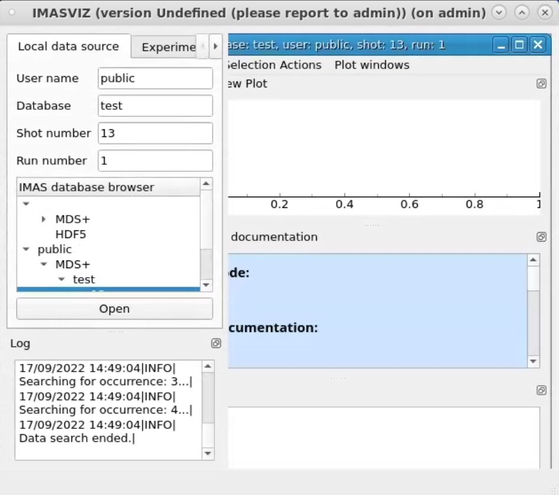
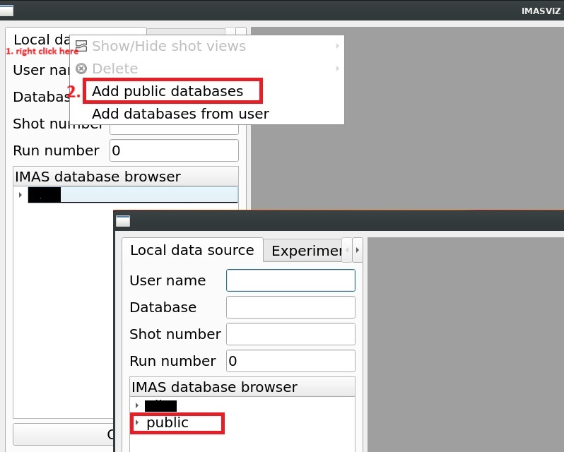

.. imas

IMAS
===========

Integrated Modelling & Analysis Suite (`IMAS <https://imas.iter.org/>`_) is the infrastructure used to build the SDP.
To use IMAS on SDP, one should load the IMAS module.

.. code-block:: bash

    [xiangliu@localhost ~] module load IMAS

---------------------------
Data Dictionary
---------------------------

Data dictionary (DD) is the basis of IMAS, which describes the physical data model for tokamak devices. To view its documentation, type ``dd_doc`` in the terminal. You can also view the `HTML documentation <http://sdp.ipp.ac.cn/dd_doc/html_documentation.html>`_ hosted on the SDP Website.

---------------------------
IMAS Database
---------------------------

The IMAS database can be managed by using the ``imasdb`` command. Type ``imasdb -h`` for help. Creation of a database locally is quite easy, simply as ``imasdb test``, which creates a database named "test" located at "$HOME/public/imasdb/test/3/0". One should not care about the exact location of the database location, since the IMAS API will automatically handle this. To access the database the "username" (typically your SDP username for local database), the "database name" (here "test"), and the "IMAS major version string" (here '3') must be provided to exactly locate the database.  

.. hint:: 
    If you want to access the public shared database, the "username" should be 'public'.

Type ``imasdb -l`` to list all the available IMAS databases. 

.. code-block:: bash

    [xiangliu@localhost ~]$ imasdb -h
    Create MDSPLUS specific directory tree <treename>/$IMAS_MAJOR_VERSION or 'default'.

    imasdb [command]                    create default tree or specify <command>.

    Commands:
        [treename]                    create path for <treename>.
                                        set to a /full/path to override the prefix ~/public.
        -r|--remove <treename>        rmdir <treename>/$IMAS_VERSION (if empty).
        -R|--remove-hard <treename>   rm -rf <treename>$IMAS_VERSION.
        -RR|--remove-all <treename>   rm -rf <treename>.
        -l|--list                     list created trees.
        -L|--list-more [treename]     list all dir (or dirs for one <treename>).
        -v|--version                  print version information.
        -h|--help                     this help message.

    [xiangliu@localhost ~]$ imasdb test
    [xiangliu@localhost ~]$ imasdb -l
    /home/xiangliu/public/imasdb/test/3/0

---------------------------
IMAS Examples
---------------------------

IMAS examples are good tutorials to learn how to use IMAS's user access layer (UAL). Copy the IMAS examples into your home directory by using ``cp -rf /work/ITER/IMAS/shared/imasexamples ~/``. Or you can also copy the corresponding codes in this tutorial, create and paste it in the corresponding IDE.

.. warning:: 
    Before moving on, please make sure you have the corresponding :ref:`Programming IDE` been configured, and you have already created an IMAS database named ``test`` (see :ref:`imas database`). If the ``test`` database is not created by ``imasdb`` command in your local home directory, the following examples will show an error code complaining that ``Error creating new file``. 

MATLAB Examples
---------------------------
Start a terminal, navigate to ``~/imasexamples/matlab`` and open MATLAB.

.. code-block:: bash

    [xiangliu@localhost ~]$ cd ~/imasexamples/matlab/
    [xiangliu@localhost matlab]$ matlab

We see two example files in the ``Current Folder`` panel or window if undocked: ``test_put.m`` (write data into the imas database) and ``test_get.m`` (read data from the imas database). You should firstly run ``test_put.m``. The detailed explanation is specified for each line.

.. code-block:: matlab

    %% Create IMAS database
    ctx = imas_create_env(...
        'ids',... % normally 'ids', keep it not changed.
        12,... % the shot number.
        1,... % the run number of this shot, a positive integer, normally 1 if there is only one run.
        12,... % reference shot number.
        1,... % reference run number.
        getenv('USER'),... % specify whether this is a public or private database. private: your user name; public: 'public'
        'test',... % the database name
        '3'); % the major version of the IMAS, echo $IMAS_VERSION for details
    if ctx < 0 % the error code is a negative integer 
        error('Unable to open shot');
    end
    
    %% Generate IDS
    m = ids_gen('magnetics'); % generate a 'magnetics' ids, refer to data dictionary for details
    
    %% Fill the data in the generated IDS
    m.ids_properties.homogeneous_time = 1; % whether the sampling time is homogeneous or not, must be filled
    m.flux_loop{1}.flux.data(1) = 10.0; % set the flux_loop data at first time point
    m.flux_loop{1}.flux.data(2) = 20.0; % set the flux_loop data at second time point
    m.time(1) = 2.0; % set first time point
    m.time(2) = 5.0; % set second time point
    
    %% Write the IDS data into the IMAS database
    ids_put(ctx, 'magnetics', m); % write the IDS data into database
    
    %% Close the IMAS database
    imas_close(ctx);

.. warning:: 
    An error might occur if you use ``imas_open_env`` to open the database file when there is no database has been created. So, we use ``imas_create_env`` to open the database file.

List your private IMAS database, you'll see the database files have been created.

.. code-block:: bash

    [xiangliu@localhost ~]$ ll ~/public/imasdb/test/3/0/
    -rw-rw-r-- 1 xiangliu imassd 44275518 Sep 30 14:26 ids_120001.characteristics
    -rw-rw-r-- 1 xiangliu imassd   157328 Sep 30 14:26 ids_120001.datafile
    -rw-rw-r-- 1 xiangliu imassd 37950976 Sep 30 14:26 ids_120001.tree

Now you can run the ``test_get.m`` script to read the data you just wrote in the database.

.. code-block:: matlab

    % Open database
    ctx = imas_open_env('ids',12,1,getenv('USER'),'test','3'); 
    if ctx < 0
        error('Unable to open shot');
    end

    %% Read the ids from the database
    m = ids_get(ctx, 'magnetics'); 

    %% Display the ids data
    disp(m.ids_properties);
    disp(m.time);
    disp(m.flux_loop{1}.flux.data);

    %% Close the database
    imas_close(ctx);

In the ``Command Window``, you'll see the outputs as follows:

.. code-block:: matlab

    >> test_get
             comment: ''
    homogeneous_time: 1
              source: ''
            provider: ''
       creation_date: ''
         version_put: [1x1 struct]
          provenance: [1x1 struct]

     2
     5

    10
    20

    >>

Quite simple, right? This is just what IMAS is designed to do: simplification of data exchange and IO operation. 

Python Examples
---------------------------

Different from MATLAB, The UAL for Python is programmed with object-oriented method, which means you'll operate data within class instead of using functions or methods to manipulate data directly (like UAL for MATLAB, see :ref:`matlab examples`).

There are quite many examples for Python, two simple scripts (``put_pf.py`` and ``get_pf.py``) will be addressed here. Start a terminal, navigate to ``~/imasexamples/python`` and type ``vi put_pf.py`` to see the source code.

.. code-block:: python3

    import imas  # simply import imas package to start
    import os  # used to get environment variable

    # # get database related information
    user_name = os.environ['USER']  # this is a private database, so your user name is used
    database_name = 'test'  # the database name
    imas_version = '3'  # you can also use os.environ['IMAS_VERSION'][:1] to get IMAS major version

    # # initialize an ids instance
    ids = imas.ids(
        12,  # shot number
        1,  # run number
        12,  # reference shot number
        1)  # reference run number

    # # create or open database
    ids.create_env(user_name, database_name, imas_version)
    if ids.isConnected():
        print('create OK!')
    else:
        raise IOError('create or open database FAILED!')

    # # fill the ids data, refer to data dictionary for structure of pf_active ids.
    ids.pf_active.ids_properties.homogeneous_time = 0  # Mandatory to define this property
    ids.pf_active.ids_properties.comment = 'Test data'

    ids.pf_active.coil.resize(2)
    ids.pf_active.coil[0].name = 'COIL 1A'
    ids.pf_active.coil[1].name = 'COIL 2B'

    number = 10  # number of elements
    ids.pf_active.coil[0].current.data.resize(number)
    ids.pf_active.coil[0].current.time.resize(number)
    for i in range(number):
        ids.pf_active.coil[0].current.data[i] = 2 * i
        ids.pf_active.coil[0].current.time[i] = i

    number = number + 2
    ids.pf_active.coil[1].current.data.resize(number)
    ids.pf_active.coil[1].current.time.resize(number)
    for i in range(number):
        ids.pf_active.coil[1].current.data[i] = 2 * i + 10
        ids.pf_active.coil[1].current.time[i] = i + number

    # # write ids data into the database
    ids.pf_active.put()

    # # close the database
    ids.close()

Type ``python3 put_pf.py`` to write pf_active data into the imas database.

.. warning:: 

    Use ``python3`` instead of system's ``python`` (will direct to ``python 3.6``), since IMAS was build with compiled ``python 3.9``. Type ``module list`` to see the loaded python module.

.. code-block:: bash

    [xiangliu@localhost ~] python3 put_pf.py
    create OK!
    ============================
    class coilObj
    Attribute name: COIL 2B
    Attribute identifier:
    Attribute function
            class function
    Attribute resistance: -9e+40
    Attribute resistance_error_upper: -9e+40
    Attribute resistance_error_lower: -9e+40
    Attribute resistance_additional
    ...
    python program over

 
``get_pf.py`` is used to read the pf_active data from the imas database. Type ``vi get_pf.py`` to see the commented source code.

.. code-block:: python3

    import imas  # simply import imas package to start
    import os  # used to get environment variable

    # # get database related information
    user_name = os.environ['USER']  # this is a private database, so your user name is used
    database_name = 'test'  # the database name
    imas_version = '3'  # you can also use os.environ['IMAS_VERSION'][:1] to get IMAS major version

    # # initialize an ids instance
    ids = imas.ids(
        12,  # shot number
        1,  # run number
        12,  # reference shot number
        1)  # reference run number

    # # open database
    ids.open_env(user_name, database_name, imas_version)
    if ids.isConnected():
        print('create OK!')
    else:
        raise IOError('create or open database FAILED!')

    # # read data from the database
    ids.pf_active.get()

    # # print the ids data
    print('========================================================')
    print('ids_properties=')
    print('   ids.pf_active.ids_properties.comment = ' + ids.pf_active.ids_properties.comment)
    print('   ids.pf_active.ids_properties.homogeneous_time = ' + str(ids.pf_active.ids_properties.homogeneous_time))

    print('========================================================')
    print('COILS')
    print('========================================================')

    for iCoil in range(len(ids.pf_active.coil)):
        print('coil[' + str(iCoil) + '].name' + ids.pf_active.coil[iCoil].name)
        print('coil[' + str(iCoil) + '].current.data:')
        print(ids.pf_active.coil[iCoil].current.data)
        print('coil[' + str(iCoil) + '].current.time:')
        print(ids.pf_active.coil[iCoil].current.time)
        print('-------------')

    # # close the database
    ids.close()

Now, you can run ``python3 get_pf.py`` to load and display the data of the pf_active data.

.. code-block:: bash

    [xiangliu@localhost ~] python3 get_pf.py
    open OK!
    ========================================================
    ids_properties=
    my_ids_obj.pf_active.ids_properties.comment = Test data
    my_ids_obj.pf_active.ids_properties.homogeneous_time = 0
    ========================================================
    COILS
    ========================================================
    coil[0].nameCOIL 1A
    coil[0].current.data:
    [ 0.  2.  4.  6.  8. 10. 12. 14. 16. 18.]
    coil[0].current.time:
    [0. 1. 2. 3. 4. 5. 6. 7. 8. 9.]
    -------------
    coil[1].nameCOIL 2B
    coil[1].current.data:
    [10. 12. 14. 16. 18. 20. 22. 24. 26. 28. 30. 32.]
    coil[1].current.time:
    [12. 13. 14. 15. 16. 17. 18. 19. 20. 21. 22. 23.]
    -------------

Now you should understand how to write and read data with imas package. The other examples generally do the similar thing, except that different ids have been used. So, the understanding of the :ref:`data dictionary` is quite important when you use IMAS's UAL.

C++ Examples
---------------------------

.. code-block:: bash

    [xiangliu@localhost ~] cd ~/imasexamples/cpp
    [xiangliu@localhost ~] make
    [xiangliu@localhost ~] ./test_magnetics_put
    [xiangliu@localhost ~] ./test_magnetics_get

Fortran Examples
---------------------------

.. code-block:: bash

    [xiangliu@localhost ~] cd ~/imasexamples/Fortran
    [xiangliu@localhost ~] make
    [xiangliu@localhost ~] ./gfortran_test_pf_put

---------------------------
Data Visualization
---------------------------

IMASViz
---------------------------

IMASViz is the official data visualization tool for IMAS Database. To use this tool simply run the bash below.

.. code-block:: bash

    [xiangliu@localhost ~] module load Viz
    [xiangliu@localhost ~] viz

This should open a GUI to plot the data. 

We see that in the database browser, all the available databases are shown. Navigate and select the "User name", "Database", "Shot number", and "Run number". Double click "Run number" to automatically fill the information above the database browser. Then click "Open" to load the ids in the right panel.

If you don't see ``public`` database in the ``IMAS database browser``, right click the ``Local data source`` and left click ``Add public databases``. Then you'll see ``public`` database in the browser.

One can view the `documentation <http://sdp.ipp.ac.cn/viz_doc/index.html>`_ for more details.
