.. user_connection

User Connection
=================

---------------------------
MobaXterm (Windows)
---------------------------
`MobaXterm <https://mobaxterm.mobatek.net/download-home-edition.html>`_ is a powerful tool on Windows for connection to Linux server and a alternative to powershell locally.

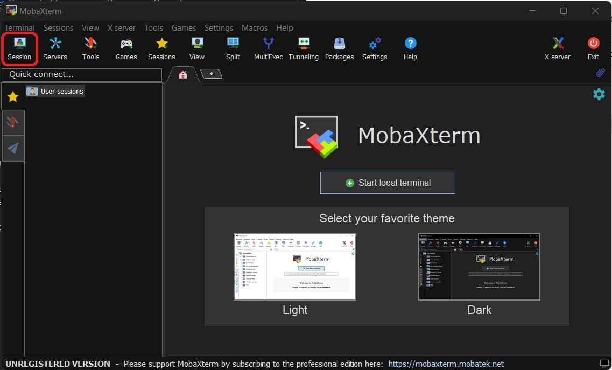

Click **Session** button as shown above, we can see that it supports many protocols, like SSH, RDP, VNC, FTP, SFTP, etc.

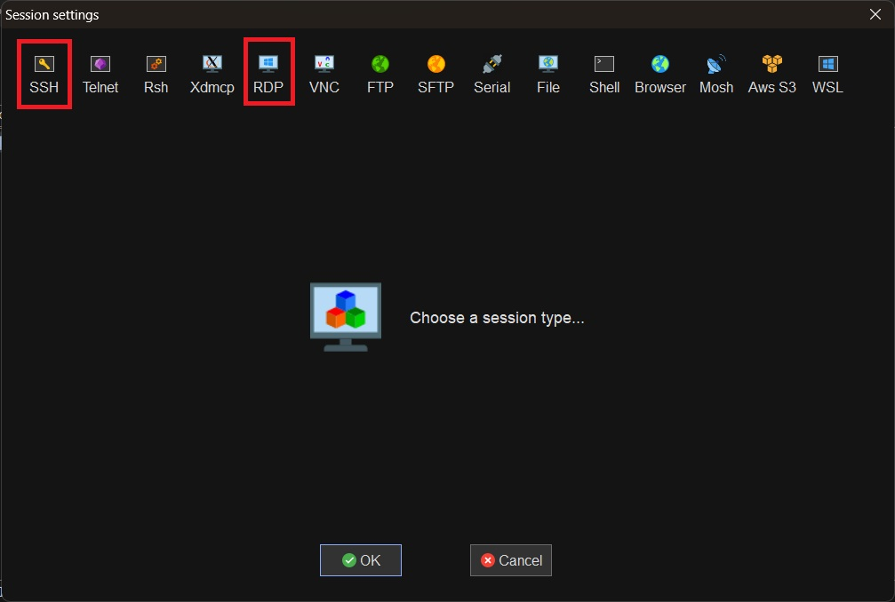

To connect to the SDP server, one can choose either SSH command-line session or RDP virtual desktop session. For both sessions, the **Remote host** should be filled with ``sdp.ipp.ac.cn``. Your user name and password are required for authentication. For SSH session, the X11-forwarding is turned on by default, meaning that GUI application can also be used just like local applications. For the RDP session, the desktop window can be detached and resized by clicking the corresponding buttons in the setting bar, as shown below.

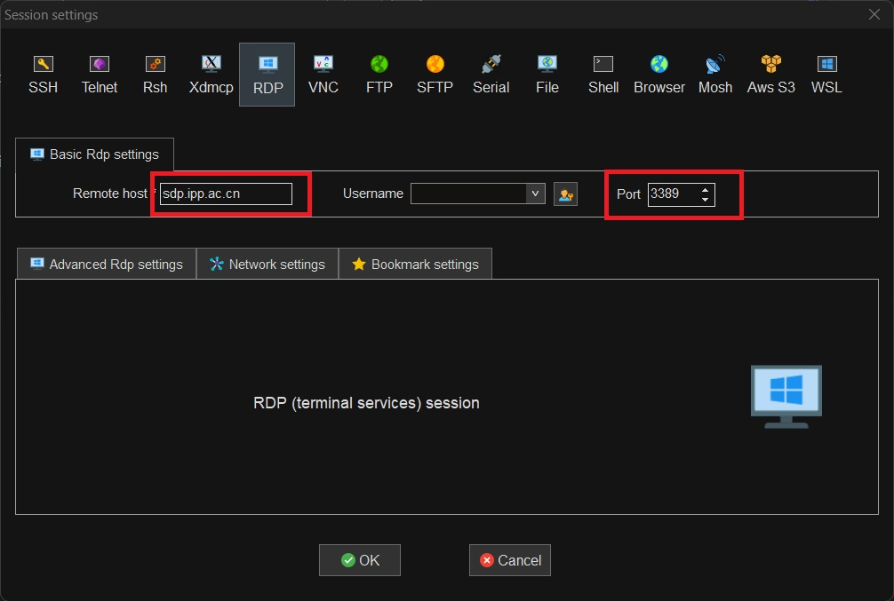

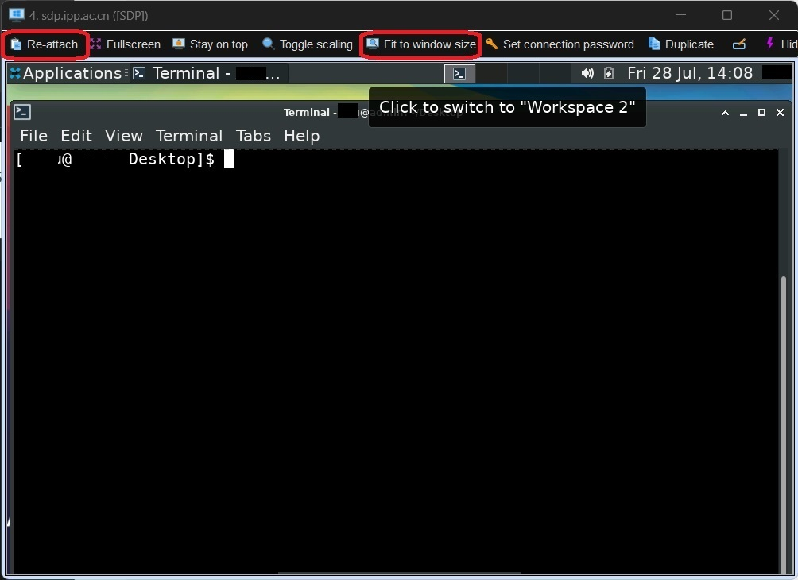

.. warning:: 

    For SSH session, the default port number has been changed (not 22), please check your account creation email for details. We recommend the user to use the RDP session, where the virtual desktop is retained even the session is disconnected. And it's easier to transfer files by copying and pasting between the SDP virtual desktop and the local desktop.

-------------------------------
SSH Connection (Linux or MacOS)
-------------------------------
If you are using Linux or MacOS, SSH connection with X11-forwarding enabled is recommend. Open the terminal and type the below command to establish the connection. The SSH port number can be found in the account creation email when your SDP account was created.

.. code-block:: bash

    ssh -X -p portnumber username@sdp.ipp.ac.cn

---------------------------
Nomachine (Offsite)
---------------------------
If you are outside the institute LAN, you are unable to access SDP directly. You need to firstly connect to the institute's gate server by `Nomachine <https://downloads.nomachine.com/>`_. Then connect to the SDP server either by SSH (see :ref:`ssh connection (linux or macos)`) or RDP (``rdesktop`` command) in terminal.

.. warning:: 
    If the connection is unstable or you do not have the account to access the gate server, please use the direct connections mentioned above.

-------------------------
Web VPN (Offsite)
-------------------------
An alternative way to access the SDP server outside the institute is to use the `Web VPN System <https://vpn.hfcas.ac.cn/>`_. Log in the system, select RDP or SSH protocol, fill ``sdp.ipp.ac.cn`` in the address box, and click the round blue button.

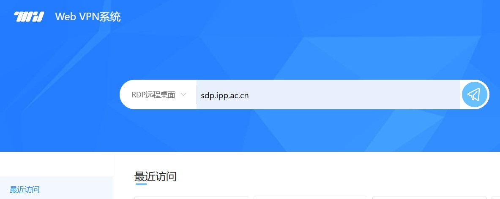

-------------------------
Windows Remote Desktop
-------------------------
You may also connect to a virtual desktop by Window's **Remote Desktop Connection** application. Fill in the address of the SDP server, and input your username and password once connected.

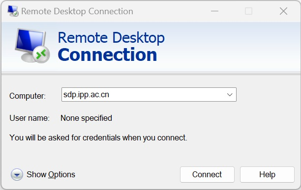

If your OS version is at least Windows 10, you could use Microsoft's new RDP client. Open Microsoft Store, search **Microsoft Remote Desktop** and install the app.

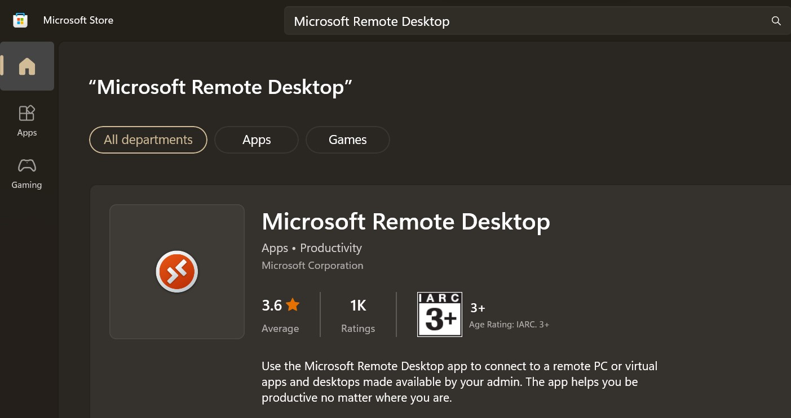

Open the installed app, click **Settings** on the top right corner. Click **+** ion in **User account** section. In this panel, you should firstly create a user account, fill in the username, password (optional), and display name, then click **Save**.

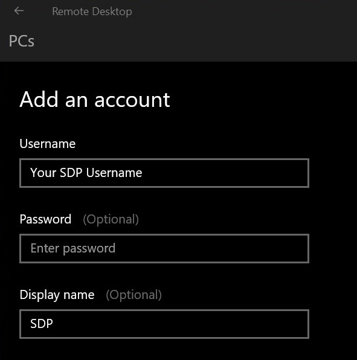

On top right corner, click **Add** next to **Settings**, choose **PCs**, fill in the SDP address, choose the created **SDP** account, and click **Save**.

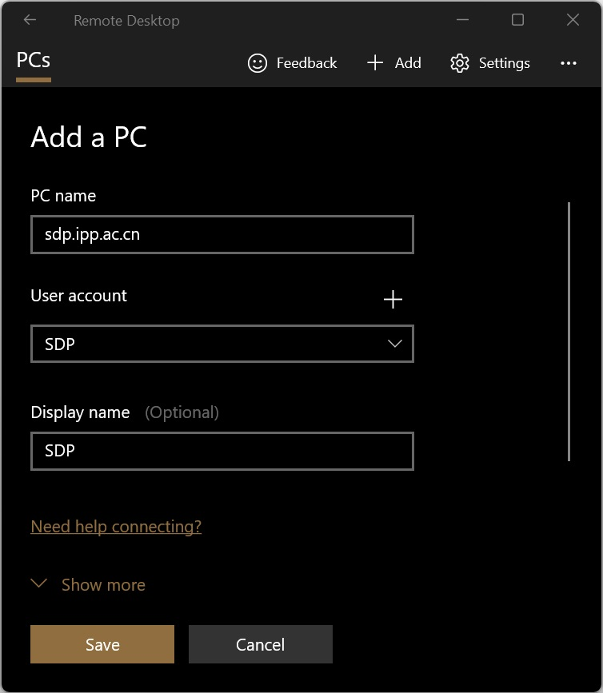

.. tip:: 
    If you have high-resolution screen, and feel the text is too small inside the remote screen. Before saving the settings, click **show more**, scroll down and set a proper screen resolution (like 1920*1080) in the **Display settings**.

Double click the created remote desktop, a new window will be opened. 

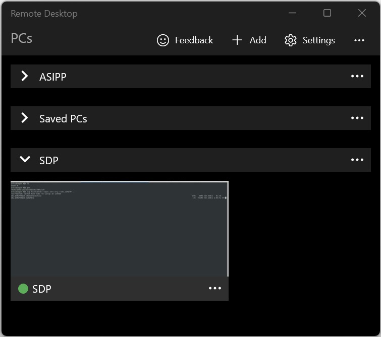

-------------------------------
MobaXterm (Offsite, deprecated)
-------------------------------

.. warning::

    NO LONG VALID: the SSH service can not be accessed outside the institute for security. This method is just used to illustrate how to connect to an RDP server over SSH connection. For instance, you could use ``sdp.ipp.ac.cn`` as a jump host and connect to virtual desktop on the login nodes.

If you are outside the institute and you are able to access the institute's gate server, you can connect to SDP with MobaXterm with gate proxy being set. Follow the instruction above, choose the **Network Settings** tab, and click **SSH gateway** to add a new jump host.

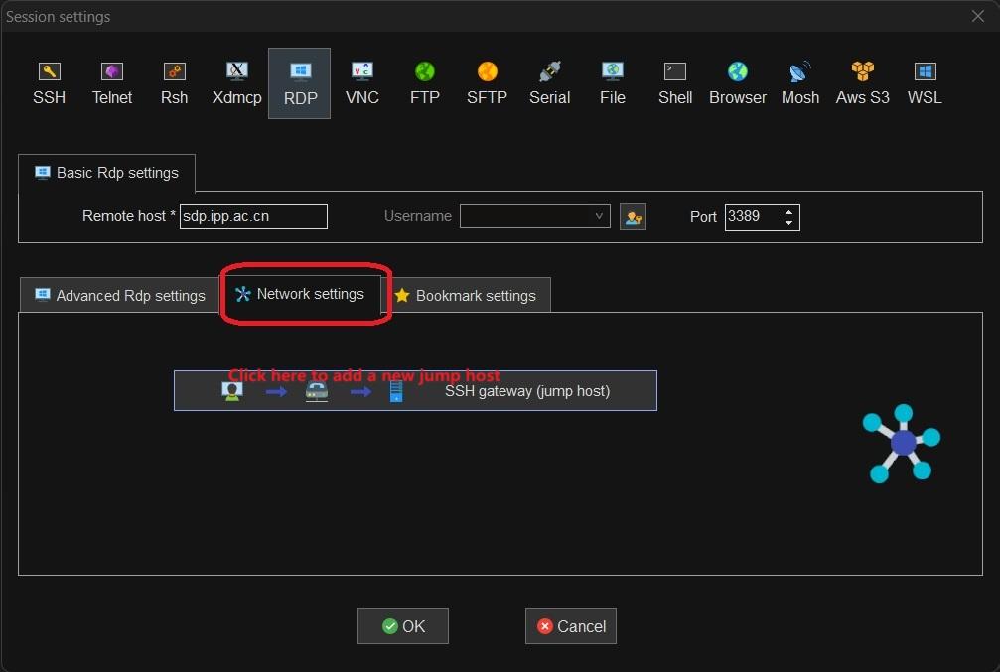

Fill in the **Gate host**, **Username**, and **Port** for the institute's Gate server. Click **OK** to finish the configuration.

.. image:: pic/user_connection_mobaxterm_jump-host.jpg

Then you should be able to access SDP through gate server. This method is also applicable for accessing other server inside the institute.

---------------------------
File Exchange
---------------------------
If you use RDP virtual desktop (**MobaXterm**, Window's **Remote Desktop Connection** or **Microsoft Remote Desktop**), file exchange is quite easy by copying and pasting between the remote and local screens.

If you use SSH connection in Linux or MacOS, command-line tools like ``rsync`` and ``scp`` can be used to exchange files between local computer and the SDP server. 

GUI tools like MobaXterm or `WinSCP <https://winscp.net>`_ are recommended for Windows and `Cyberduck <https://cyberduck.io/>`_ is recommended for MacOS.

You may also map the server home directory locally in Windows as a network hard drive through `SFTP Net Drive <https://www.nsoftware.com/sftpdrive/download>`_ (free for personal use). 

.. warning:: 
    
    As mentioned above, the SSH (so as SFTP) port number is not 22.
