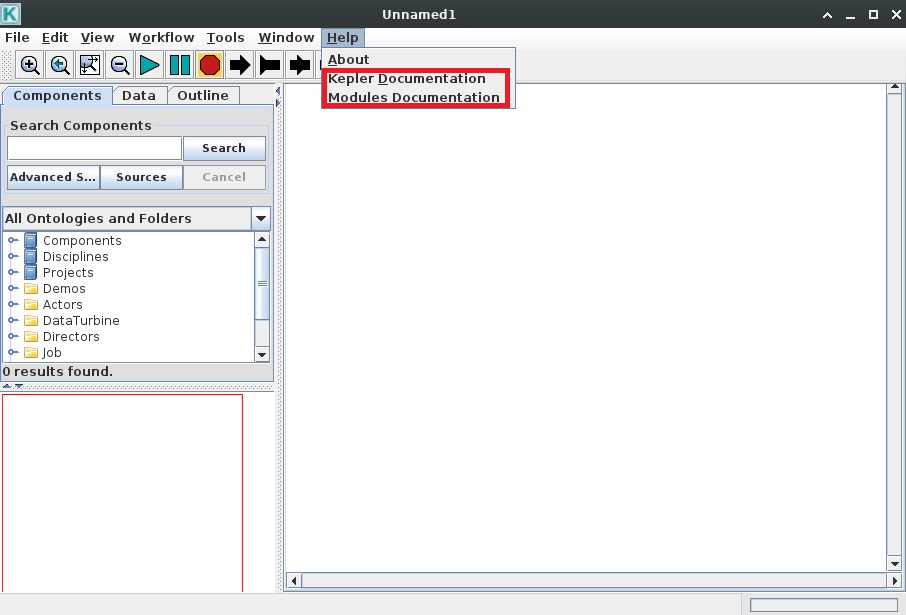

.. util

Utilities
============

-------------------
Kepler
-------------------

`Kepler <https://kepler-project.org/>`_ is an open-source tool for scientific workflow applications. To use Kepler on SDP, type the following commands in the terminal.

.. code-block:: bash

    [xiangliu@localhost] ml Kepler
    [xiangliu@localhost] kepler.sh

One can click **Help** to view the documentation or view the `Kepler documentation <https://kepler-project.org/users/documentation.html>`_ online.